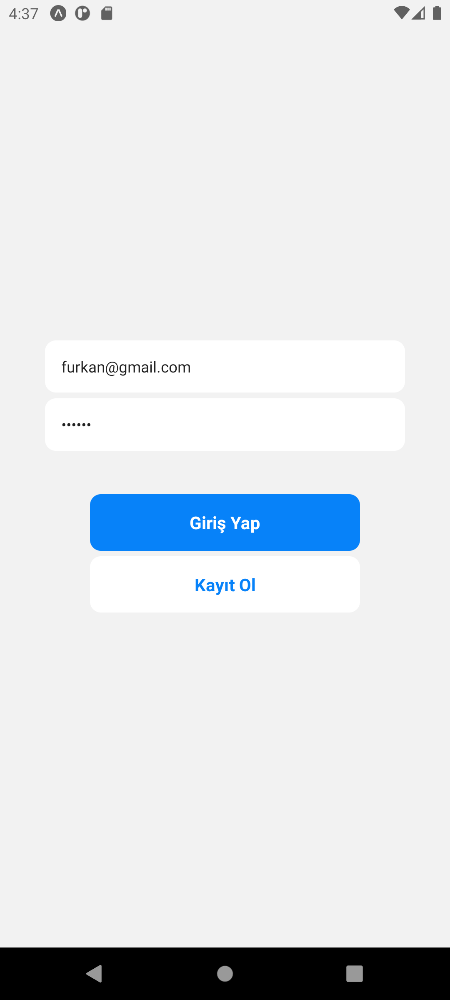
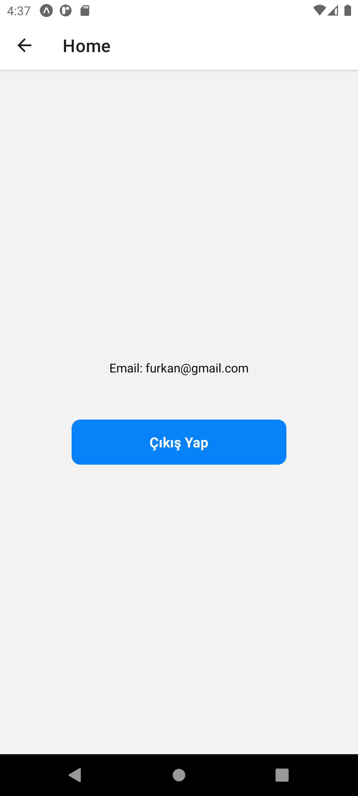

# Login App

<div align="center">
  
</div>

## About the Project

This React Native app allows users to sign up, log in, and log out using Firebase authentication.

## Table of Contents

- [Technologies Used](#technologies-used)
- [Usage](#usage)
- [Project Skeleton](#project-skeleton)
- [Screenshots](#screenshots)

## Technologies Used

- [Expo](https://expo.dev/)
- [React Native](https://reactnative.dev/)
- [Firebase](https://firebase.google.com/)
- [React Navigation](https://reactnavigation.org/)

## Usage

- Use the login screen to sign in with your email and password.
- If you don't have an account, you can sign up by tapping the "Sign Up" button and providing your email and password.
- Once logged in, you will be redirected to the home screen where you can see your email address and sign out by tapping the "Sign Out" button.

## Technologies Used

```
Login App (folder)
│
├── assets
│     └── [images]
├── screens
│     ├── HomeScreen.jsx    
│     └── LoginScreen.jsx 
├── .gitignore
├── App.js
├── app.json
├── babel.config.js
├── firebase.js
├── package-lock.json
├── package.json
└── README.md
```

## Screenshots

<div align="center">
  
  
</div>